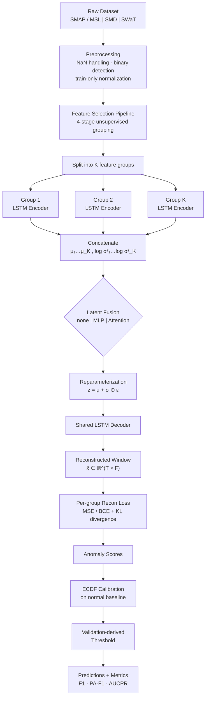
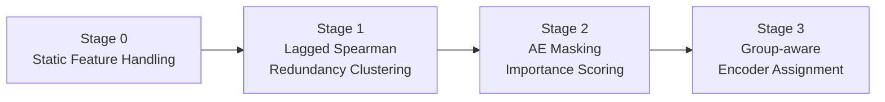

# Grouped Autoencoder — Grouped LSTM-VAE

> Grouped **LSTM-VAE** for multivariate time-series anomaly detection with unsupervised feature grouping, optional latent fusion, and validation-calibrated anomaly scoring.

The core model is a **grouped LSTM variational autoencoder (LSTM-VAE)**. The implementation targets **high-dimensional multivariate sensor streams** where feature redundancy and heterogeneous dynamics make single-encoder models less effective.

Evaluated on three benchmark datasets:

| Dataset | Domain | Entry Point |
|---------|--------|-------------|
| **SMAP / MSL** | NASA spacecraft telemetry | `main_smap.py` |
| **SMD** | Server machine metrics | `main_smd.py` |
| **SWaT** | Secure water treatment plant | `main_swat.py` |

---

## Highlights

- **Grouped encoder architecture** — one LSTM encoder per learned feature group
- **Variational latent modelling** — group-wise μ / log σ² with reparameterization trick
- **Shared LSTM decoder** — reconstructs the full multivariate window jointly
- **Optional latent fusion** — `none`, `mlp`, `mlp_mean`, `attn_mean`, `attn_both`
- **Binary-aware loss** — MSE for continuous groups, BCE-with-logits for binary groups
- **Leakage-free evaluation** — ECDF-calibrated scoring with validation-only thresholds

---

## Architecture Overview



---

## Feature Selection Pipeline

Feature grouping is fully **unsupervised** and computed on **training data only**.



| Stage | What it does |
|-------|--------------|
| **0 — Static features** | Drop zero-variance continuous features; retain static binary features as a sentinel group (they may only flip during anomalies). |
| **1 — Redundancy clustering** | First-difference the signals, compute lagged absolute Spearman correlation, then agglomerative-cluster features above a threshold. Each cluster is represented by its medoid. |
| **2 — AE masking importance** | Train a lightweight LSTM-AE on the cluster representatives and estimate per-feature importance via block-permutation masking. |
| **3 — Encoder assignment** | High-importance clusters each get their own encoder; lower-importance clusters are merged into a catch-all group. Static binary features form a separate sentinel group. |

---

## Evaluation Protocol

1. Train the model on normal / training data.
2. Fit **per-group ECDFs** on a normal baseline loader (`fit_group_ecdf`).
3. Convert each group's reconstruction loss into a **two-sided tail score**: `s = −log(2 · min(F(ℓ), 1−F(ℓ)) + ε)`.
4. Aggregate per-group scores (mean or max).
5. Derive the anomaly **threshold from validation data only** (`compute_threshold_from_baseline`).
6. Evaluate on the test set — Point F1, Point-adjust F1, AUCPR, ROC-AUC.

> Some legacy evaluation paths still exist for backward compatibility. For strict no-leakage reporting, always use the ECDF + validation-threshold path.

---

## Setup

```bash
pip install -r requirements.txt
```

Core runtime dependencies: `torch`, `numpy`, `pandas`, `scipy`, `scikit-learn`, `matplotlib`, `optuna`, `tqdm`.

Then update **dataset paths** in [`config.py`](config.py).

---

## Running Experiments

### SMAP / MSL

```bash
# Edit config.py: DATASET_TYPE = "SMAP", CHANNEL = "E-1"
python main_smap.py
```

### SMD

```bash
# Edit config.py: MACHINE = "machine-1-1.txt"
python main_smd.py
```

### SWaT

```bash
# Edit config.py: paths to normal / attack CSVs
python main_swat.py
```

Optional SWaT speed controls via environment variables:

```bash
export SWAT_TRAIN_SUBSAMPLE_RATIO=0.5
export SWAT_VAL_SUBSAMPLE_RATIO=0.5
python main_swat.py
```

Set `USE_OPTUNA = True` in `config.py` to enable Optuna hyperparameter search instead of using the pre-tuned defaults.

---

## Key Files

| File | Description |
|------|-------------|
| [`config.py`](config.py) | Central configuration — dataset paths, hyperparameters, device settings, and pre-tuned defaults for each dataset. |
| [`models.py`](models.py) | Model definitions: `LSTMEncoder`, `SharedDecoder`, `LSTMVAE_Grouped`, `ResidualMLPFusion`, `GroupSelfAttentionFusion`. |
| [`training.py`](training.py) | Group-weighted loss function, training loop with early stopping, AMP support, model checkpointing. |
| [`evaluation.py`](evaluation.py) | Anomaly scoring (raw + ECDF-calibrated), threshold estimation, F1 / AUCPR / ROC-AUC, point-adjust evaluation. |
| [`data_loader.py`](data_loader.py) | Dataset loaders for SMAP/MSL, SMD, and SWaT. Preprocessing, binary detection, normalization, `GroupedSequenceDataset`. |
| [`feature_selection.py`](feature_selection.py) | 4-stage unsupervised pipeline: static handling → lagged Spearman clustering → AE masking importance → encoder assignment. |
| [`visualization.py`](visualization.py) | Optuna study visualization and experiment summary utilities. |
| [`main_smap.py`](main_smap.py) | End-to-end entry point for SMAP / MSL channels. |
| [`main_smd.py`](main_smd.py) | End-to-end entry point for SMD machines. |
| [`main_swat.py`](main_swat.py) | End-to-end entry point for SWaT with validation-calibrated ECDF scoring. |
| [`optuna_tuning.py`](optuna_tuning.py) | Optuna objective construction, pruning-aware training, and evaluation helpers. |
| [`requirements.txt`](requirements.txt) | Python dependency snapshot for the development environment. |

---

## Reproducibility

- Random seeds are set via `set_seed(42)` in each main script.
- Continuous features are standardized using **train-only** statistics.
- Binary / two-valued features are normalized to [0, 1] for BCE compatibility.
- Feature selection runs on **training data only**.
- Thresholds are derived from **validation data only** — never from the test set.
